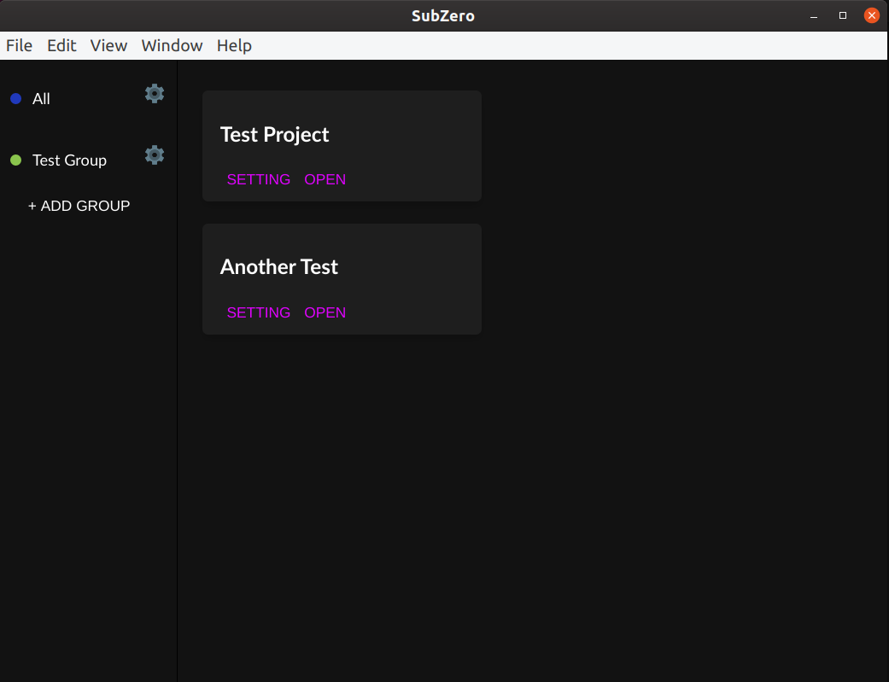

# SubZero




### Start

```java
npm install

npm start
```

### Build project
  
```java
// For Linux
npm run package-linux

// For Window
npm run package-win

// For MacOS
npm run package-mac
```

### Testing

```
npm test
```